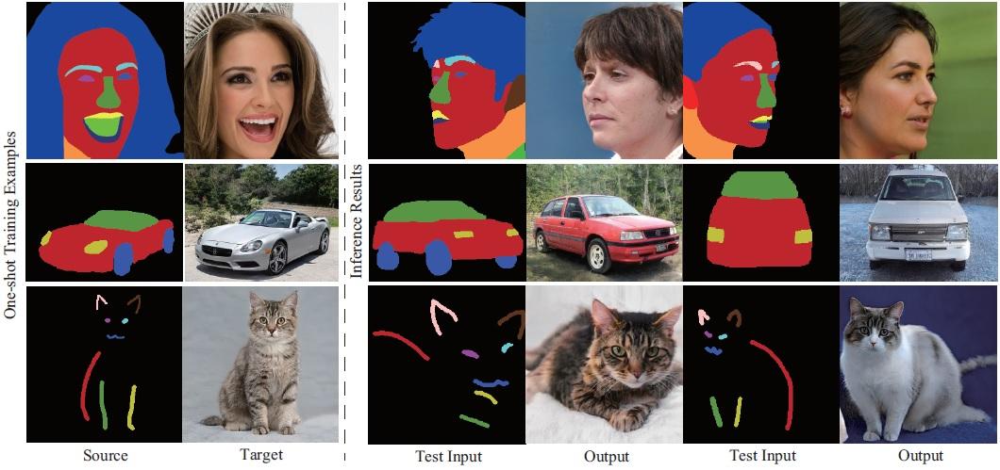
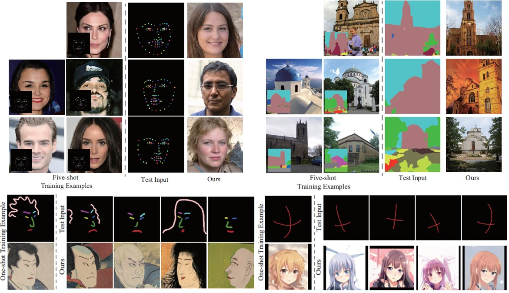
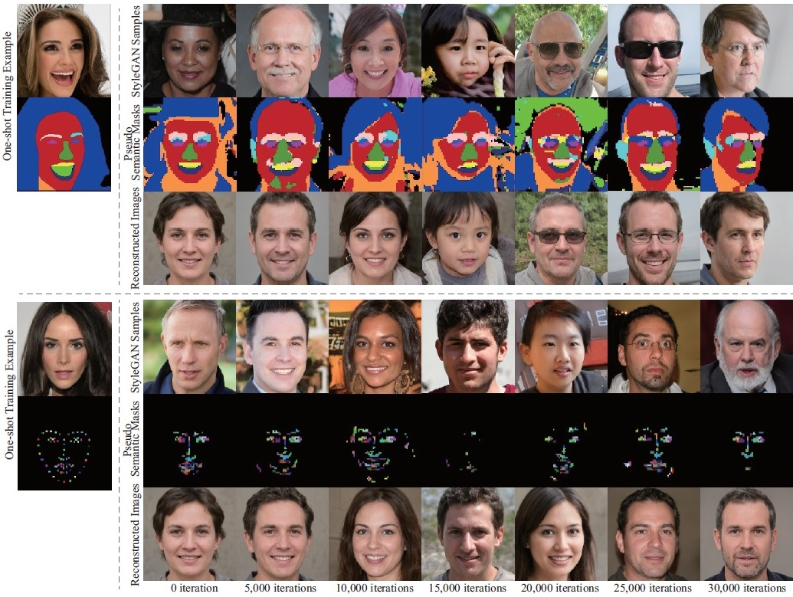

# Few-shot Semantic Image Synthesis Using StyleGAN Prior
  <a href="https://arxiv.org/abs/2103.14877"></a>
  <a href="https://opensource.org/licenses/MIT"></a>
<p align="center">

<br>
Our method can synthesize photorealistic images from dense or sparse semantic annotations using a few training pairs and a pre-trained StyleGAN. 
</p>

## Prerequisites  
1. Python3
2. PyTorch

## Preparation
Download and decompress <a href="https://drive.google.com/file/d/1s-AS7WRUbL3MzEALxM8y4_XO3n3panxH/view?usp=sharing">the file containing StyleGAN pre-trained models</a> and put the "pretrained_models" directory in the parent directory.

## Inference with our pre-trained models
1. Download and decompress <a href="https://drive.google.com/file/d/14y0mAxJa167hzrkStiNKLEX_bBxfsnb9/view?usp=sharing">the file containing our pretrained encoders</a> and put the "results" directory in the parent directory. 
2. For example, our results for celebaMaskHQ in a one-shot setting can be generated as follows:
```
python scripts/inference.py --exp_dir=results/celebaMaskHQ_oneshot --checkpoint_path=results/celebaMaskHQ_oneshot/checkpoints/iteration_100000.pt --data_path=./data/CelebAMask-HQ/test/labels/ --couple_outputs --latent_mask=8,9,10,11,12,13,14,15,16,17
```
Inference results are generated in results/celebaMaskHQ_oneshot. If you use other datasets, please specify --exp_dir, --checkpoint_path, and --data_path appropriately. 

<p align="center">

</p>


## Training
For each dataset, you can train an encoder as follows:
- CelebAMask
```
python scripts/train.py --exp_dir=[result_dir] --dataset_type=celebs_seg_to_face --stylegan_weights pretrained_models/stylegan2-ffhq-config-f.pt --start_from_latent_avg --label_nc 19 --input_nc 19
```
- CelebALandmark
```
python scripts/train.py --exp_dir=[result_dir] --dataset_type=celebs_landmark_to_face --stylegan_weights pretrained_models/stylegan2-ffhq-config-f.pt --start_from_latent_avg --label_nc 71 --input_nc 71 --sparse_labeling
```
<p align="center">

<br>
Intermediate training outputs with the StyleGAN pre-trained with the CelebA-HQ dataset. It can be seen that the layouts of the bottom-row images reconstructed from the middle-row pseudo semantic masks gradually become close to those of the top-row StyleGAN samples as the training iterations increase. 
</p>

- LSUN church
```
python scripts/train.py --exp_dir=[result_dir] --dataset_type=lsunchurch_seg_to_img --stylegan_weights pretrained_models/stylegan2-church-config-f.pt --style_num 14 --start_from_latent_avg --label_nc 151 --input_nc 151
```
- LSUN car
```
python scripts/train.py --exp_dir=[result_dir] --dataset_type=lsuncar_seg_to_img --stylegan_weights pretrained_models/stylegan2-car-config-f.pt --style_num 16 --start_from_latent_avg --label_nc 5 --input_nc 5
```
- LSUN cat
```
python scripts/train.py --exp_dir=[result_dir] --dataset_type=lsuncat_scribble_to_img --stylegan_weights pretrained_models/stylegan2-cat-config-f.pt --style_num 14 --start_from_latent_avg --label_nc 9 --input_nc 9 --sparse_labeling
```
- Ukiyo-e
```
python scripts/train.py --exp_dir=[result_dir] --dataset_type=ukiyo-e_scribble_to_img --stylegan_weights pretrained_models/ukiyoe-256-slim-diffAug-002789.pt --style_num 14 --channel_multiplier 1 --start_from_latent_avg --label_nc 8 --input_nc 8 --sparse_labeling
```
- Anime
```
python scripts/train.py --exp_dir=[result_dir] --dataset_type=anime_cross_to_img --stylegan_weights pretrained_models/2020-01-11-skylion-stylegan2-animeportraits-networksnapshot-024664.pt --style_num 16 --start_from_latent_avg --label_nc 2 --input_nc 2 --sparse_labeling
```

## Using StyleGAN samples as few-shot training data
1. Run the following script:
```
python scripts/generate_stylegan_samples.py --exp_dir=[result_dir] --stylegan_weights ./pretrained_models/stylegan2-ffhq-config-f.pt --style_num 18 --channel_multiplier 2
```
Then a StyleGAN image (\*.png) and a corresponding latent code (\*.pt) are obtained in [result_dir]/data/images and [result_dir]/checkpoints. 

2. Manually annotate the generated image in [result_dir]/data/images and save the annotated mask in [result_dir]/data/labels. 

3. Edit ./config/data_configs.py and ./config/paths_config.py appropriately to use the annotated pairs as a training set. 

4. Run a training command above with appropriate options. 

## Citation
Please cite our paper if you find the code useful:
```
@article{endo2021fewshotsmis,
  title = {Few-shot Semantic Image Synthesis Using StyleGAN Prior},
  author = {Yuki Endo and Yoshihiro Kanamori},
  journal   = {CoRR},
  volume    = {abs/2103.14877},
  year      = {2021}
}
```

## Acknowledgements
This code heavily borrows from the [pixel2style2pixel](https://github.com/eladrich/pixel2style2pixel) repository. 
